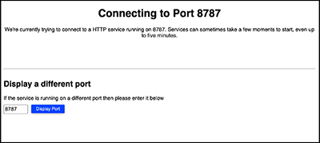

# Let's do RStudio Stuff!

Click in the "RStudio Demo" tab to the right...
**it may take a few minutes to load**.  

***And don't hit "Continue" until you're ready to end.***

You might see what looks like an error screen, such as the one below.  Don't panic!  

